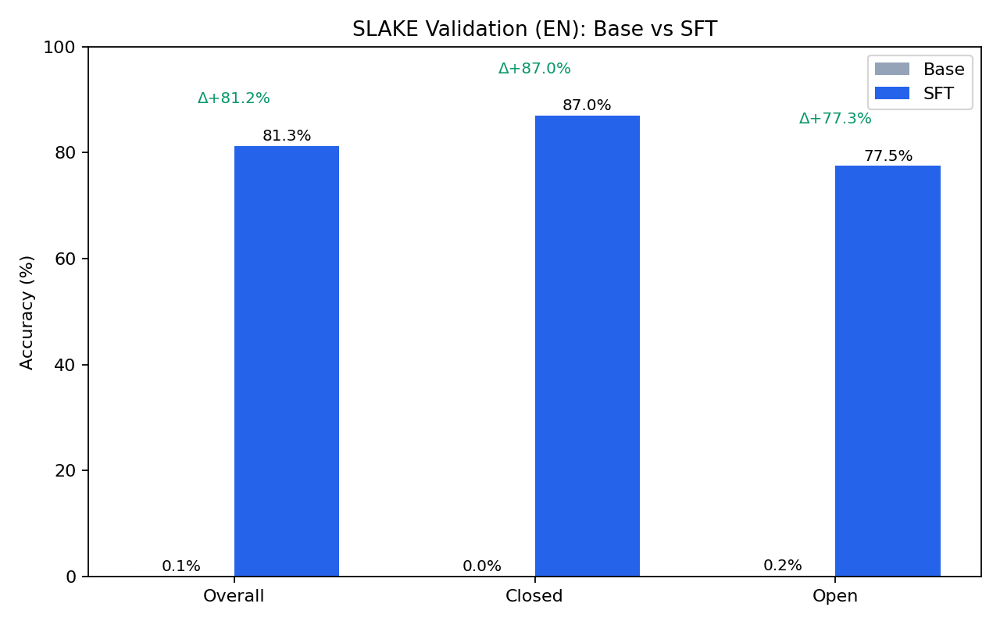
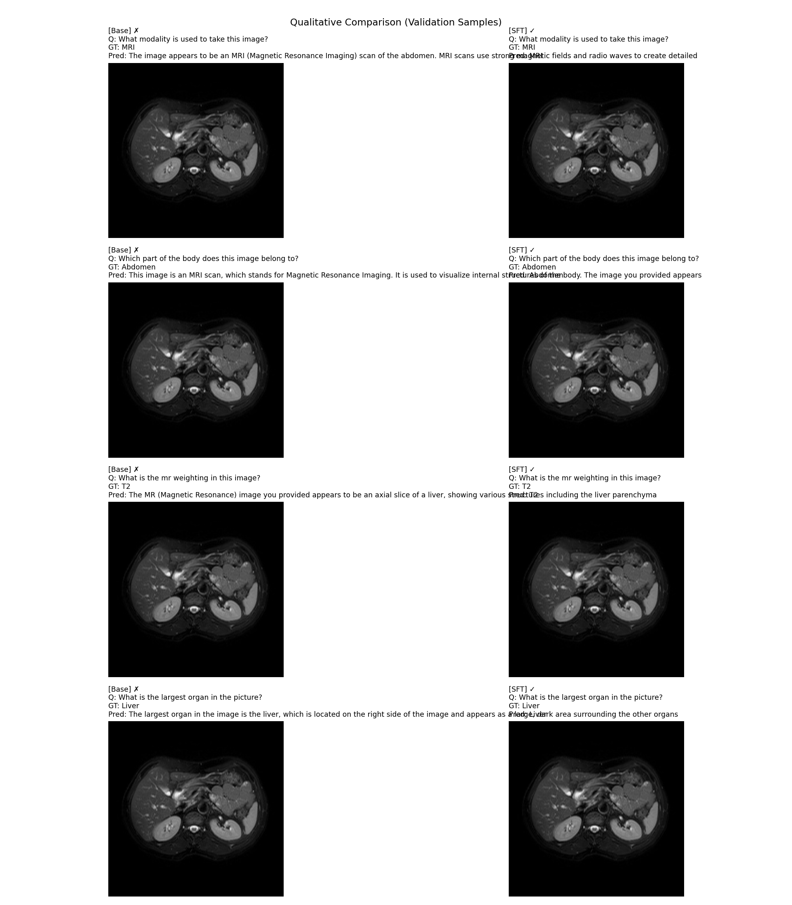

# Qwen2.5-VL 医学 VQA 微调（SLAKE 数据集）

基于 [Qwen2.5-VL-3B-Instruct](https://huggingface.co/Qwen/Qwen2.5-VL-3B-Instruct) 在 [SLAKE](https://huggingface.co/datasets/BoKelvin/SLAKE) 医学影像问答数据集上进行监督微调（SFT）。SLAKE 是面向放射影像的医学 VQA benchmark，涵盖 CT、MRI、X-Ray 三种模态，包含开放式（器官名称、模态识别）和封闭式（Yes/No 异常判断）两类问题。

## 实验结果

在冻结 Vision Encoder、微调 MLP + LLM 的设置下，3 epoch 全参数 SFT 后，模型在 SLAKE 英文验证集上取得显著提升：



| 指标 | 基座模型（Base） | 微调后（SFT） | 提升 |
|------|----------------|-------------|------|
| **Overall（总体）** | 0.1% | **81.3%** | +81.2% |
| **Closed（封闭式 Yes/No）** | 0.0% | **87.0%** | +87.0% |
| **Open（开放式）** | 0.2% | **77.5%** | +77.3% |

基座模型倾向于输出长段落描述（如 *"The image appears to be an MRI scan..."*），无法与 SLAKE 的短答案 ground truth（`MRI`、`Yes`、`Abdomen` 等）精确匹配；SFT 后模型学会了输出符合 SLAKE 格式的简洁回答。



训练 loss 在 1845 步（3 epoch）内从 ~2.6 收敛到 **0.082**：

| 训练配置 | 值 |
|---------|----|
| 基座模型 | Qwen2.5-VL-3B-Instruct（3.75B 参数） |
| 可训练参数 | 3.12B（Vision Encoder 冻结） |
| 训练数据 | SLAKE 英文训练集 4,919 条 QA |
| 硬件 | 单卡 NVIDIA A800 80GB |
| 有效 Batch Size | 8（per_device=2 × grad_accum=4） |
| 学习率 | 2e-5，cosine schedule |
| 精度 | bf16 + Flash Attention 2 + gradient checkpointing |
| 训练时长 | ~70 分钟（含一次磁盘满中断续训） |
| 最终 Train Loss | 0.082 |

## 项目结构

```
qwenvl2.5-sft-SLAKE/
├── finetuning/
│   ├── configs/sft_slake.py           # SFT 训练配置
│   ├── dataset/
│   │   ├── slake_vqa_dataset.py       # SLAKE VQA 数据集（直接读取 JSON + 图片）
│   │   └── collator.py                # 数据对齐（padding、多模态 batch 拼接）
│   ├── scripts/sft_slake.sh           # 训练启动脚本
│   └── train.py                       # 训练入口
├── scripts/
│   ├── preprocess_slake.py            # 数据预处理与验证
│   └── eval_slake_val.py              # 验证集评估 pipeline
├── records/
│   ├── experiments.md                 # 完整实验日志（exp-001 ~ exp-008）
│   ├── data/CHANGELOG.md              # 数据集版本变更记录
│   └── results/exp-008/               # 准确率对比图与指标
├── configs/snapshots/                 # 每次实验的配置快照（可复现）
└── SFT_DATAFLOW.md                    # SFT 完整数据流分析（含 tensor shape 追踪）
```

## 复现指南

### 1. 环境配置

```bash
pip install torch==2.6.0 torchvision==0.21.0
pip install -e . --no-deps
pip install -e finetuning --no-deps
pip install -r requirements.txt
MAX_JOBS=8 pip install flash-attn==2.7.4.post1 --no-build-isolation
```

### 2. 数据准备

从 HuggingFace 下载 SLAKE 数据集：

```bash
export HF_ENDPOINT=https://hf-mirror.com  # 如果 huggingface.co 无法直连
hf download BoKelvin/SLAKE --repo-type dataset --local-dir datasets/SLAKE
cd datasets/SLAKE && unzip -q imgs.zip && unzip -q KG.zip
```

预处理英文训练集：

```bash
python scripts/preprocess_slake.py --split train --q-lang en \
  --output datasets/SLAKE/manifests/train_en.json
```

### 3. 训练

先冒烟测试（64 条样本，10 步）：

```bash
bash finetuning/scripts/sft_slake_smoke.sh
```

正式训练（3 epoch）：

```bash
bash finetuning/scripts/sft_slake.sh
```

> **注意**：包含 optimizer state 的 checkpoint 约 19GB/个。建议在训练配置中设置 `save_only_model=True`，将 checkpoint 体积降至 ~7GB/个，避免磁盘写满。

### 4. 评估

```bash
python scripts/eval_slake_val.py --output-dir records/results/eval --max-new-tokens 32
```

## 实验记录

从环境搭建到最终评估的所有实验过程均记录在 [records/experiments.md](records/experiments.md) 中：

- exp-001：环境配置与基座模型下载
- exp-003：系统盘清理（释放 19GB 空间）
- exp-004：SLAKE 数据集下载与验证
- exp-005：训练框架恢复与数据预处理
- exp-006：冒烟测试（loss 2.88→0.10，10步）
- exp-007：正式 SFT 训练（3 epoch，loss 2.6→0.082）
- exp-008：验证集评估与可视化（81.3% 准确率）

每次实验的配置快照保存在 [configs/snapshots/](configs/snapshots/) 目录。

## 技术要点

- **数据格式**：对话遵循 Qwen2.5-VL chat template，使用 `<image>` 占位符；视觉 token 使用 mRoPE（多模态旋转位置编码）
- **Loss Mask**：仅 assistant 回复部分的 token 参与 loss 计算，system prompt、用户问题、视觉 token、padding 均用 `IGNORE_INDEX=-100` 掩码
- **多模态融合**：视觉特征通过 `masked_scatter` 按位替换到文本 embedding 序列中 `<|image_pad|>` 对应的位置（非拼接、非 cross-attention）

完整的 SFT 数据流从原始 JSON 到 loss 标量的 tensor shape 级拆解见 [SFT_DATAFLOW.md](SFT_DATAFLOW.md)。

## License

本项目用于学习和研究目的。
